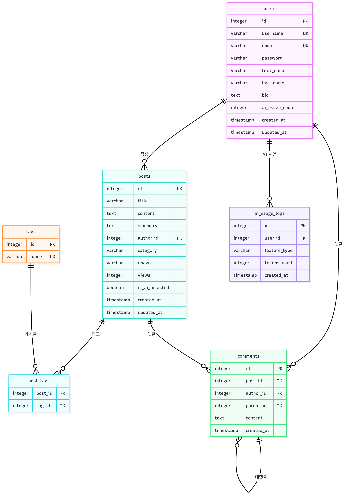

# 🚀 Smart Blog
Smart Blog는 OpenAI GPT-4 API를 활용한 AI 기반 블로그 플랫폼입니다. 

---

## 📖 프로젝트 소개

사용자가 더 쉽고 효과적으로 글을 작성할 수 있도록 다양한 AI 도구를 제공하며, 실시간 상호작용이 가능한 모던한 커뮤니티 기능을 갖추고 있습니다.

### ✨ 주요 특징

- 🤖 **AI 글쓰기 도우미**: 제목 추천, 자동완성, 태그 제안, 요약 생성
- 💬 **실시간 상호작용**: AJAX 기반 댓글, 좋아요, 팔로우 시스템
- 👥 **소셜 기능**: 팔로우/팔로워, 프로필 시스템
- 🎨 **프로페셔널 디자인**: 반응형 UI, 일관된 디자인 시스템
- 🔒 **보안**: CSRF 보호, 권한 기반 접근 제어

---

## 🛠️ 기술 스택

| 구분       | 기술                                                     |
|----------|-----------------------------------------------------------|
| Backend  | Django, Python, PostgreSQL, Django Auth, Custom User Model|
| Auth     | 세션 기반 인증, Django Auth, Custom User Model              |
| API      | OpenAI ChatGPT                                            |
| Frontend | Bootstrap 5, HTML, CSS, Vanilla JS, AJAX                  |
| Storage  | Django Media Files, Django Static Files                   |

---

## 📁 프로젝트 구조

```
SMARTBLOG/
├── 📁 smartblog/                    # 프로젝트 루트 디렉토리
│   ├── 📄 settings.py               # Django 설정 파일
│   ├── 📄 urls.py                   # 메인 URL 라우팅
│
├── 📁 accounts/                     # 사용자 인증 앱
│   ├── 📄 admin.py                  # 관리자 설정
│   ├── 📄 apps.py                   # 앱 설정
│   ├── 📄 models.py                 # CustomUser, Follow 모델
│   ├── 📄 urls.py                   # 인증 URL 라우팅
│   └── 📄 views.py                  # 인증, 프로필 뷰
│
├── 📁 blog/                         # 블로그 메인 앱
│   ├── 📄 admin.py                  # 관리자 설정
│   ├── 📄 ai_service.py             # OpenAI API 서비스 모듈
│   ├── 📄 ai_urls.py                # AI 기능 URL
│   ├── 📄 ai_views.py               # AI 기능 API 뷰
│   ├── 📄 apps.py                   # 앱 설정
│   ├── 📄 models.py                 # Post, Comment, Tag, Like, AIUsageLog
│   ├── 📄 urls.py                   # 블로그 URL 라우팅
│   └── 📄 views.py                  # 블로그 CRUD, 댓글, 좋아요 뷰
│
├── 📁 media/                        # 업로드된 파일
│   ├── 📁 posts/                    # 게시글 이미지
│   └── 📁 profiles/                 # 프로필 이미지
│
├── 📁 static/                       # 정적 파일
│   ├── 📁 css/
│   │   └── 📄 style.css             # 메인 스타일시트
│   ├── 📁 img/                      # 이미지 파일
│   └── 📁 admin/                    # Django 관리자 정적 파일
│       └── 📁 css/
│
├── 📁 staticfiles/                  # 배포용 정적 파일 (collectstatic)
│   ├── 📁 admin/
│   ├── 📁 css/
│   └── 📁 img/
│
├── 📁 templates/                    # HTML 템플릿
│   ├── 📁 accounts/                 # 인증 관련 템플릿
│   │   ├── 📄 follower_list.html    # 팔로워 목록
│   │   ├── 📄 following_list.html   # 팔로잉 목록
│   │   ├── 📄 login.html           # 로그인 페이지
│   │   ├── 📄 password_change.html  # 비밀번호 변경
│   │   ├── 📄 profile.html         # 프로필 페이지
│   │   ├── 📄 profile_update.html   # 프로필 수정
│   │   └── 📄 signup.html          # 회원가입 페이지
│   │
│   ├── 📁 blog/                     # 블로그 관련 템플릿
│   │   ├── 📄 post_confirm_delete.html  # 게시글 삭제 확인
│   │   ├── 📄 post_detail.html      # 게시글 상세보기
│   │   ├── 📄 post_form.html        # 게시글 작성/수정
│   │   └── 📄 post_list.html        # 게시글 목록
│   │
│   ├── 📄 404.html                  # 404 에러 페이지
│   ├── 📄 base.html                 # 기본 템플릿
│   └── 📄 main.html                 # 메인 페이지
│
├── 📄 .env                          # 환경변수 (보안상 Git 제외)
├── 📄 .gitignore                    # Git 무시 파일 목록
├── 📄 manage.py                     # Django 관리 스크립트
├── 📄 or_generator.py               # QR 코드 생성기
├── 📄 README.md                     # 프로젝트 문서
└── 📄 requirements.txt              # Python 패키지 의존성
```

---

## 🔧 주요 디렉토리 설명

### 📁 smartblog/ (메인 프로젝트)
- Django 프로젝트의 핵심 설정 파일들
- `settings.py`: 데이터베이스, AI API, 정적 파일 설정
- `urls.py`: URL 라우팅 설정

### 📁 accounts/ (사용자 관리)
- 회원가입, 로그인, 프로필 관리
- CustomUser 모델을 통한 확장된 사용자 정보
- 팔로우/팔로워 시스템

### 📁 blog/ (블로그 핵심)
- 게시글 CRUD 기능
- 댓글, 좋아요, 태그 시스템
- AI 서비스 통합 모듈

### 📁 templates/ (프론트엔드)
- 반응형 HTML 템플릿
- Bootstrap 5 기반 UI/UX
- AJAX 실시간 처리

### 📁 static/ & 📁 media/
- 정적 파일 (CSS, 이미지)
- 사용자 업로드 파일
- 배포용 정적 파일 관리

---

## 📅 프로젝트 일정 (WBS)

```m
gantt
    title Smart Blog 개발 일정
    dateFormat  YYYY-MM-DD
    section 기획 및 설계
    요구사항 분석           :done, req, 2024-07-02, 1d
    UI/UX 설계             :done, design, 2024-07-02, 1d
    DB 모델링              :done, db, 2024-07-02, 1d
    
    section 백엔드 개발
    Django 프로젝트 설정    :done, setup, 2024-07-02, 1d
    사용자 인증 시스템       :done, auth, 2024-07-03, 1d
    블로그 CRUD 기능        :done, crud, 2024-07-03, 1d
    AI 통합 시스템          :done, ai, 2024-07-04, 1d
    댓글 시스템            :done, comment, 2024-07-04, 1d
    소셜 기능              :done, social, 2024-07-05, 1d
    
    section 프론트엔드 개발
    템플릿 구조 설계        :done, template, 2024-07-03, 1d
    반응형 UI 구현          :done, ui, 2024-07-04, 1d
    AJAX 상호작용          :done, ajax, 2024-07-05, 1d
    
    section 테스트 및 배포
    기능 테스트            :done, test, 2024-07-06, 1d
    배포 준비              :active, deploy, 2024-07-07, 1d
    문서화                 :active, doc, 2024-07-07, 1d
    최종 배포              :future, final, 2024-07-08, 1d
```

---

## 💡 ERD (Entity Relationship Diagram)



---

## 📊 DataBase Table 구조

### CustomUser
```python
- username: 사용자명
- email: 이메일
- bio: 자기소개
- ai_usage_count: AI 사용 횟수
```

### Post
```python
- title: 제목
- content: 내용
- summary: AI 생성 요약
- author: 작성자 (ForeignKey)
- category: 카테고리
- tags: 태그 (ManyToMany)
- image: 대표 이미지
- views: 조회수
- is_ai_assisted: AI 도움 여부
```

### Comment
```python
- post: 게시글 (ForeignKey)
- author: 작성자 (ForeignKey)
- parent: 부모 댓글 (Self ForeignKey)
- content: 내용
```

### Follow
```python
- follower: 팔로우하는 사용자
- following: 팔로우받는 사용자
- created_at: 팔로우 시작일
```

### Like
```python
- user: 사용자 (ForeignKey)
- post: 게시글 (ForeignKey)
- created_at: 좋아요 일시
```

### AIUsageLog
```python
- user: 사용자 (ForeignKey)
- feature_type: AI 기능 타입
- tokens_used: 사용된 토큰 수
- created_at: 사용 일시
```

---

# 🔗 Smart Blog URL 구조 매핑

## 📋 전체 URL 구조

### 🏠 루트 URLs (`smartblog/urls.py`)
```python
urlpatterns = [
    path("admin/", admin.site.urls),                # 관리자 페이지
    path("", main_view, name="main"),               # 메인 페이지
    path("blog/", include("blog.urls")),            # 블로그 기능
    path("accounts/", include("accounts.urls")),    # 사용자 인증
    # Static/Media files (DEBUG 모드)
    path("media/", serve, {"document_root": MEDIA_ROOT}),
    path("static/", serve, {"document_root": STATIC_ROOT}),
]
```

## 🔐 사용자 인증 URLs (`accounts/urls.py`)

| URL | HTTP Method | View | 설명 | 권한 |
|-----|-------------|------|------|------|
| `/accounts/signup/` | GET, POST | SignUpView | 회원가입 | 공개 |
| `/accounts/login/` | GET, POST | CustomLoginView | 로그인 | 공개 |
| `/accounts/logout/` | POST | CustomLogoutView | 로그아웃 | 로그인 필요 |
| `/accounts/profile/` | GET | ProfileView | 내 프로필 | 로그인 필요 |
| `/accounts/profile/<int:user_id>/` | GET | ProfileView | 다른 사용자 프로필 | 공개 |
| `/accounts/profile/update/` | GET, POST | ProfileUpdateView | 프로필 수정 | 본인만 |
| `/accounts/password/change/` | GET, POST | CustomPasswordChangeView | 비밀번호 변경 | 본인만 |
| `/accounts/follow/<int:user_id>/` | POST | FollowToggleView | 팔로우/언팔로우 (AJAX) | 로그인 필요 |
| `/accounts/followers/<int:user_id>/` | GET | FollowerListView | 팔로워 목록 | 공개 |
| `/accounts/following/<int:user_id>/` | GET | FollowingListView | 팔로잉 목록 | 공개 |

---

## 📝 블로그 URLs (`blog/urls.py`)

### 📄 게시글 관련
| URL | HTTP Method | View | 설명 | 권한 |
|-----|-------------|------|-----|------|
| `/blog/` | GET | PostListView | 게시글 목록 | 공개 |
| `/blog/write/` | GET, POST | PostCreateView | 새 글 작성 | 로그인 필요 |
| `/blog/<int:pk>/` | GET | PostDetailView | 게시글 상세보기 | 공개 |
| `/blog/<int:pk>/edit/` | GET, POST | post_update | 게시글 수정 | 작성자만 |
| `/blog/<int:pk>/delete/` | GET, POST | PostDeleteView | 게시글 삭제 | 작성자만 |

### 💬 댓글 관련 (AJAX)
| URL | HTTP Method | View | 설명 | 권한 |
|-----|-------------|------|------|------|
| `/blog/comment/<int:post_id>/create/` | POST | CommentCreateView | 댓글 작성 | 로그인 필요 |
| `/blog/comment/<int:comment_id>/delete/` | POST | CommentDeleteView | 댓글 삭제 | 작성자/게시글작성자 |
| `/blog/comment/<int:comment_id>/update/` | POST | CommentUpdateView | 댓글 수정 | 작성자만 |
| `/blog/comments/<int:post_id>/` | GET | CommentListView | 댓글 목록 조회 | 공개 |

### 💖 좋아요 관련 (AJAX)
| URL | HTTP Method | View | 설명 | 권한 |
|-----|-------------|------|------|------|
| `/blog/like/<int:post_id>/` | POST | LikeToggleView | 좋아요/취소 | 로그인 필요 |

### 🤖 AI 기능 관련 (AJAX)
| URL | HTTP Method | View | 설명 | 권한 |
|-----|-------------|------|------|------|
| `/blog/ai/suggest-title/` | POST | TitleSuggestionView | AI 제목 추천 | 로그인 필요 |
| `/blog/ai/complete-content/` | POST | ContentCompletionView | AI 자동완성 | 로그인 필요 |
| `/blog/ai/suggest-tags/` | POST | TagSuggestionView | AI 태그 추천 | 로그인 필요 |
| `/blog/ai/generate-summary/` | POST | SummaryGenerationView | AI 요약 생성 | 로그인 필요 |
| `/blog/ai/usage-stats/` | GET | ai_usage_stats | AI 사용량 통계 | 로그인 필요 |
    
---

## 🔒 권한별 URL 분류
   
### 🌍 공개 (로그인 불필요)
- `/` - 메인 페이지
- `/blog/` - 게시글 목록
- `/blog/{pk}/` - 게시글 상세
- `/accounts/signup/` - 회원가입
- `/accounts/login/` - 로그인
- `/accounts/profile/{user_id}/` - 사용자 프로필
- `/accounts/followers/{user_id}/` - 팔로워 목록
- `/accounts/following/{user_id}/` - 팔로잉 목록
   
### 🔐 로그인 필요
- `/blog/write/` - 글 작성
- `/accounts/profile/` - 내 프로필
- `/accounts/logout/` - 로그아웃
- 모든 AI 기능 URLs
- 모든 댓글/좋아요 URLs
- 모든 팔로우 기능 URLs
   
### 👤 작성자/본인만
- `/blog/{pk}/edit/` - 글 수정 (작성자)
- `/blog/{pk}/delete/` - 글 삭제 (작성자)
- `/accounts/profile/update/` - 프로필 수정 (본인)
- `/accounts/password/change/` - 비밀번호 변경 (본인)
- `/blog/comment/{id}/update/` - 댓글 수정 (작성자)

### 🛡️ 특별 권한
- `/blog/comment/{id}/delete/` - 댓글 삭제 (작성자 또는 게시글 작성자)
- `/admin/` - 관리자 페이지 (슈퍼유저)

---

## 🔄 URL 이름(name) 활용

### 템플릿에서 사용
```html
<!-- 링크 생성 -->
<a href="">블로그 목록</a>
<a href="">새 글 작성</a>
<a href="">글 보기</a>
<a href="">프로필</a>

<!-- 폼 액션 -->
<form method="post" action="">
<form method="post" action="">
```

### 뷰에서 리다이렉트
```python
from django.urls import reverse_lazy, reverse
from django.shortcuts import redirect

# 성공 URL 설정
success_url = reverse_lazy('post_list')

# 동적 리다이렉트
return redirect('post_detail', pk=post.id)
return redirect('user_profile', user_id=user.id)
```

### JavaScript에서 AJAX 요청
```javascript
// AI 기능
fetch('/blog/ai/suggest-title/', { method: 'POST' })
fetch('/blog/ai/complete-content/', { method: 'POST' })

// 댓글 기능
fetch('/blog/comment/1/create/', { method: 'POST' })
fetch('/blog/comment/1/delete/', { method: 'POST' })

// 소셜 기능
fetch('/blog/like/1/', { method: 'POST' })
fetch('/accounts/follow/1/', { method: 'POST' })
```

---

## 📱 모바일 URL 호환성

모든 URL은 반응형 디자인을 지원하며, 모바일에서도 동일한 URL 구조를 사용합니다.

- 터치 최적화된 UI
- 모바일 친화적 폼
- 반응형 네비게이션
- 스와이프 제스처 지원

### QR 코드 사용법
```python
python manage.py runserver 8000
ngrok http 8000
python qr_generator.py
```

---

## 🔒 보안 기능

### CSRF 보호
- 모든 POST 요청에 CSRF 토큰 필수
- Django 기본 CSRF 미들웨어 활용

---

## 👨‍💻 Developer

**S.H.H (Smart Blog)**
- GitHub: [@Hyeoni-729](https://github.com/Hyeoni-729)